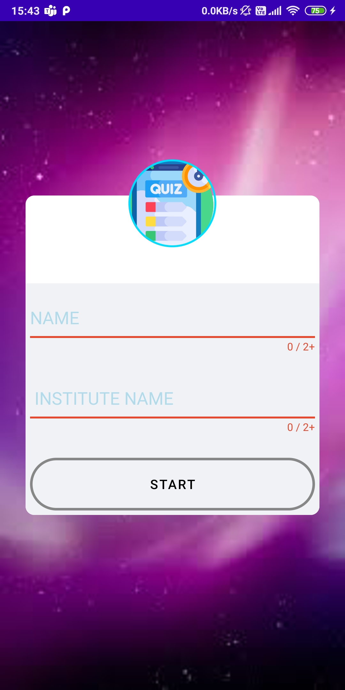
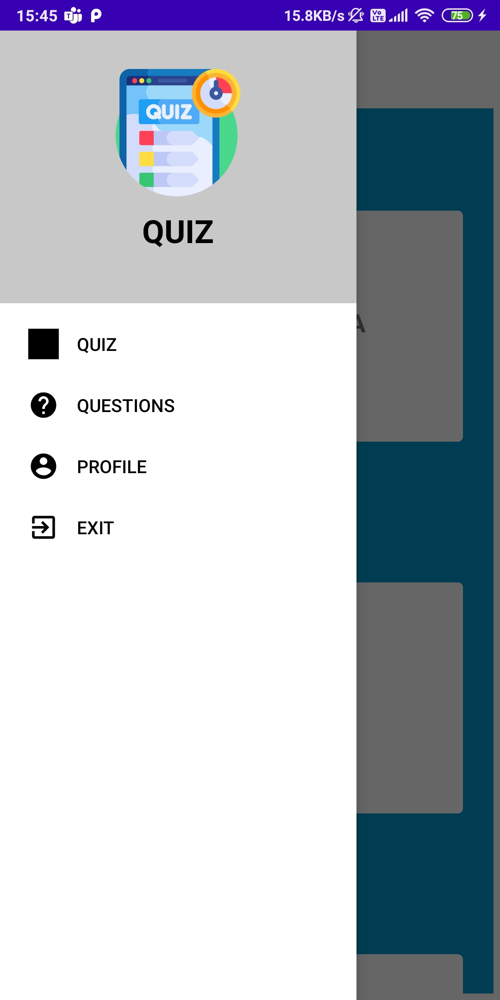
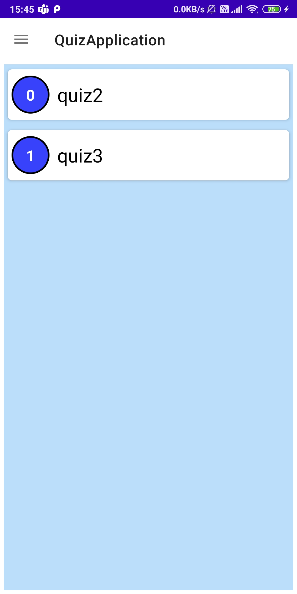
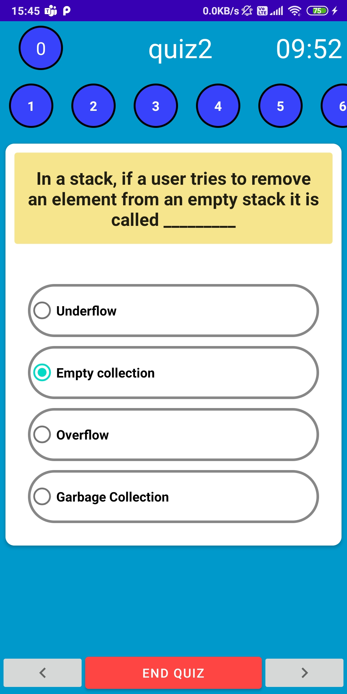
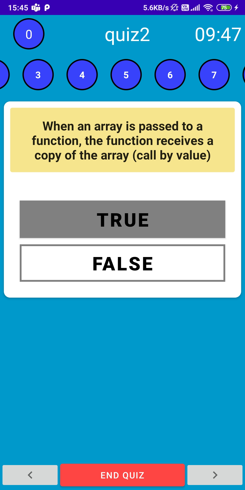
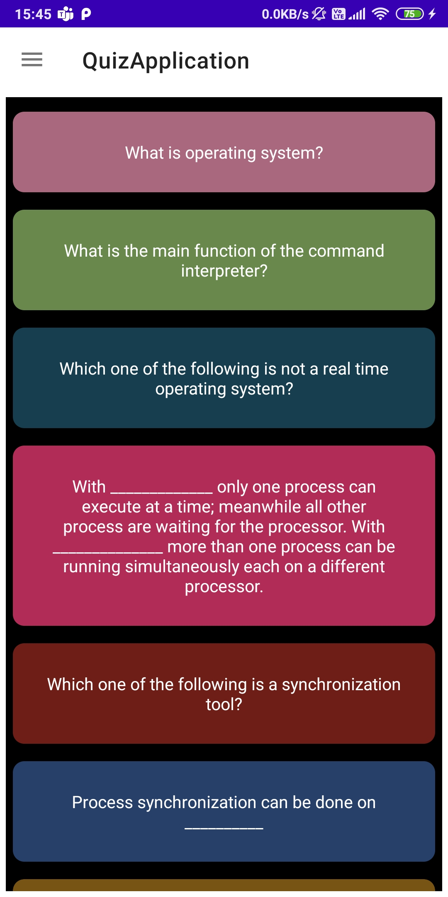
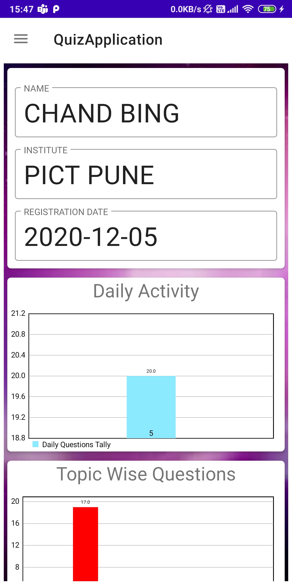
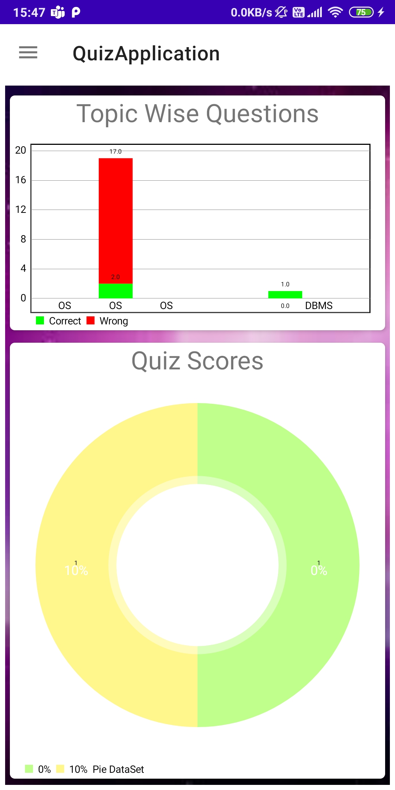

# Quiz_application_android

A Quiz application designed and developed to practice MCQ questions. Supports single correct, multiple correct, true/false type MCQ questions. App also tracks daily activity of the user, topicwise & testwise performance of the user.
Developed by group of three students -
Krishna Bhutada, Sourav Batgiri, Pratik Bhojane
outputs -

     

     

     

     

     

     

     

     

